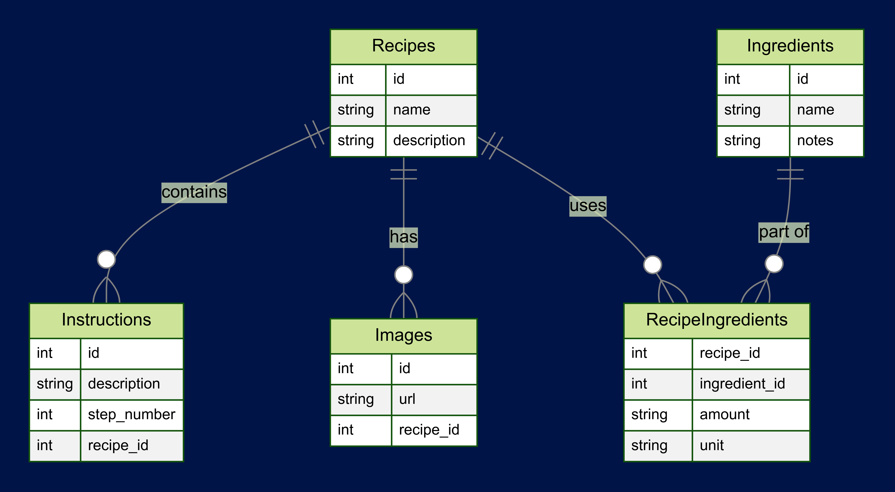

# ETL-RecipeProject

## Overview
ETL-RecipeProject is a comprehensive ETL (Extract, Transform, Load) project developed for CS50P and CS50SQL. This project focuses on scraping recipes from the Panlasang Pinoy website, cleaning and transforming the data, and then loading it into a SQL database. The Python app is designed to extract recipe information, transform it into a structured format, and load it into a SQLite database for further use.



## Features
- **Data Scraping**: Extracts recipes and ingredient information from the Panlasang Pinoy website.
- **Data Transformation**: Cleans and normalizes the data, including handling duplicate ingredients.
- **Data Loading**: Inserts the transformed data into a structured SQLite database.
- **Schema Management**: Automatically runs the schema script to create and update the database schema.
#### Video Demo:  <https://youtu.be/sca_IBNjdus>

## Installation and Setup
### Prerequisites
- Python 3
- Required libraries:
  - `sqlite3`
  - `json`
  - `csv`
  - `re`
  - `bs4`
  - `os`
  - `requests`
  - `pyfiglet`

### Installation Steps
1. Clone the repository:
   ```bash
   git clone https://github.com/yourusername/ETL-RecipeProject.git
   cd ETL-RecipeProject
2. Run the application:
   ```bash
   python project.py

### Install the required libraries:
 - pip install beautifulsoup4 requests pyfiglet

### Running the App
To run the Python app and start the ETL process, execute the following command:

### License
MIT License

### Author/s
Dhanco Mendoza (@dhnxx)

### Additional Information
For more details about the database design, refer to the DESIGN.md file in this repository.
